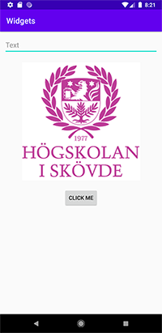

# Rapport


Först ändrades layouten activity_main.xml till en LinearLayout och lade sedan in widgetarna EditText, Button och Imageview. Det valdes att lägga alla widgets centrerat med hjälp av följande kodrad:
```
android:layout_gravity="center"
```

Alla widgets har även en marginal på 10dp.
```
android:layout_margin="10dp"
```
Koden är commitad efter var och en av widgetarna blivit skapade.



**Figur 1:** Appen

